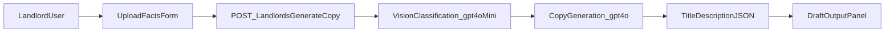

# Landlord Listing Copy Generator Plan

## Outcome

Build a new `Landlords` demo route with a form-driven workflow:

1. upload photos + enter key listing facts, 2) run OpenAI vision-based image understanding, 3) generate polished listing title + full description, 4) render editable/copyable draft output.

## Implementation Approach

### 1) Add dedicated landlord route and UI shell

- Create a new page at [`axxelist-concierge/src/app/landlords/page.tsx`](axxelist-concierge/src/app/landlords/page.tsx) for a standalone demo experience.
- Add a client component (new) at [`axxelist-concierge/src/components/landlord-copy-generator.tsx`](axxelist-concierge/src/components/landlord-copy-generator.tsx) with:
  - Photo upload (multiple images, preview thumbnails, remove action)
  - Facts form (beds, baths, sqft, neighborhood, rent, pet policy, amenities, standout notes)
  - Generate button + loading/error states
  - Output area for generated `title` + `description` with copy controls

### 2) Build backend API for multimodal generation

- Add route [`axxelist-concierge/src/app/api/landlords/generate-copy/route.ts`](axxelist-concierge/src/app/api/landlords/generate-copy/route.ts).
- Accept `multipart/form-data` to support local image uploads only.
- Validate fields using `zod` (required numeric ranges and non-empty neighborhood/context facts).
- Convert uploaded images into OpenAI-compatible image input payloads.
- Use a two-stage OpenAI flow:
  - **Image classification/extraction stage** (`gpt-4o-mini` vision): infer visual attributes (room type cues, finishes, natural light, perceived style, condition, notable features).
  - **Copy generation stage** (`gpt-4o`): combine extracted visual cues + user facts to produce structured output `{ title, description }` with explicit schema constraints.
- Add timeout/fallback handling so failures return a clear demo-safe error message.

### 3) Add shared typing for request/response contracts

- Extend [`axxelist-concierge/src/lib/types.ts`](axxelist-concierge/src/lib/types.ts) with landlord copy-generator types (form payload shape, vision summary shape, generated copy response).
- Keep these types aligned across client and route for strict TypeScript checks.

### 4) UX polish for demo quality

- Keep the page visually aligned with the existing product style (Axxelist brand, clean two-column layout).
- Add clear helper copy describing expected inputs and what AI uses.
- Include disabled/loading states and concise inline validation feedback.
- Ensure output is easy to demo live (instant copy button + regeneration option).

### 5) Verify and demo readiness

- Run lint checks on touched files and fix regressions.
- Run one functional browser pass (`ui-flow-browser-tester`) for: upload → generate → output verification + error-state checks.
- Run one visual QA pass (`visual-ui-browser-qa`) across desktop/tablet/mobile for this new screen before sign-off.

## Data Flow

## Notes

- This remains **demo-only** (no DB insert), matching your selected scope.
- This supports **local file upload** only, matching your selected input mode.
- Uses OpenAI’s multimodal capability as the image classification tool in the existing stack.
